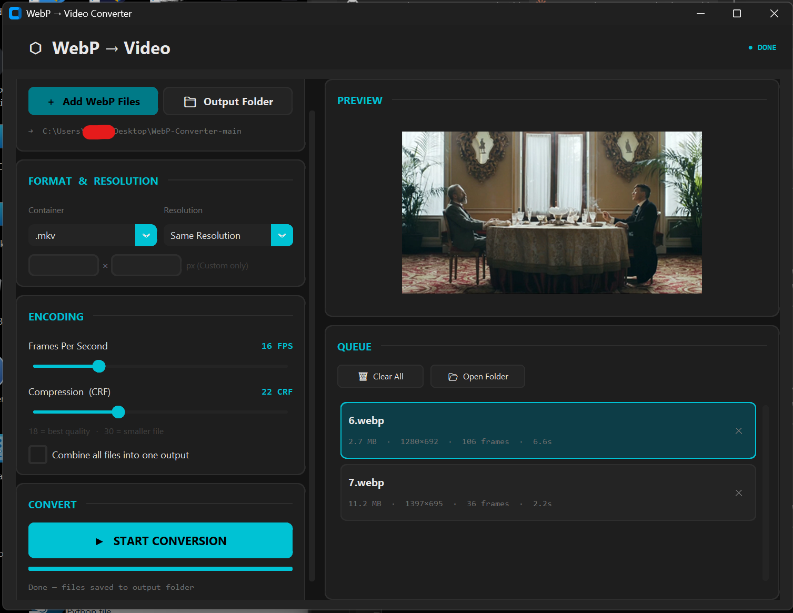

# WebP-Converter
A simple, beautiful, and powerful tool to convert animated WebP images into videos (.mp4, .mkv, .webm, .gif).

<h1 align="center">WebP to Video Converter</h1>

<p align="center">
  
  
  
</p>

---

## About

**WebP to Video Converter** is a modern, easy-to-use tool for converting animated `.webp` images into high-quality `.mp4`, `.mkv`, `.webm`, or `.gif` files.

Built in Python with a dark-themed UI using [CustomTkinter](https://github.com/TomSchimansky/CustomTkinter), direct FFmpeg encoding via [imageio-ffmpeg](https://github.com/imageio/imageio-ffmpeg), and image handling by [Pillow](https://github.com/python-pillow/Pillow). Originally based on [Dunttus' webptomp4](https://github.com/Dunttus/webptomp4).

<p align="center">
  
</p>

---

## Features

- Convert animated WebP images to `.mp4`, `.mkv`, `.webm`, or `.gif`
- **Original frame timing** — preserves each frame's real duration (variable frame rate), or force a constant FPS (1-60)
- Resolution presets `480p` / `720p` / `1080p` / `4K` keep aspect ratio (no stretching), plus exact custom dimensions
- Compression quality control (CRF 18-30)
- Combine multiple WebP files into a single output — mixed sizes are letterboxed, GIF supported
- **Drag & drop** files or folders straight into the window
- Live progress with real encode percentage
- Animated preview with checkerboard transparency, real timing, and click/Space to pause
- Cancel running conversions instantly — no partial files left behind
- Per-file status indicators and rich metadata (size, dimensions, frames, duration) in the queue
- Clean output names (`name.mp4`, `name (1).mp4`, …) — no random suffixes
- Keyboard shortcuts: `Ctrl+O` add files, `Ctrl+Enter` convert, `Space` pause preview, `Delete` remove, `Escape` cancel
- Settings and window size persist between sessions
- Modern dark UI
- Standalone EXE/binary build via PyInstaller
- Cross-platform: Windows, macOS, Linux

---

## Quick Start (Windows)

Download the portable EXE from [Releases](https://github.com/iTroy0/WebP-Converter/releases) — no install required.

---

## Run From Source

Requires Python 3.9+ with pip.

### Windows

```bash
# Option A: use the interactive menu
start.bat

# Option B: manual
pip install -r requirements.txt
python webp_converter_gui.py
```

### Linux / macOS

```bash
# Make the script executable (first time only)
chmod +x start.sh

# Option A: use the interactive menu
./start.sh

# Option B: manual
pip install -r requirements.txt
python3 webp_converter_gui.py
```

---

## Build Standalone Binary

### Windows

Run `start.bat` and choose option **2** (Build Standalone EXE).
The output will be at `dist/WebP Converter.exe`.

### Linux / macOS

```bash
chmod +x start.sh
./start.sh
# Choose option 2
```

The output will be at `dist/WebP Converter`.

---

## Project Structure

| File | Purpose |
|---|---|
| `webp_converter_gui.py` | Main application |
| `requirements.txt` | Python dependencies |
| `start.bat` | Interactive launcher/builder (Windows) |
| `start.sh` | Interactive launcher/builder (Linux/macOS) |
| `install_requirements.bat` | Quick dependency install (Windows) |
| `app_icon.ico` | Application icon |

---

## Support

If you find this project helpful, feel free to [buy me a coffee](https://buymeacoffee.com/itroy0)!

[](https://buymeacoffee.com/itroy0)

---

## Credits

- UI: [CustomTkinter](https://github.com/TomSchimansky/CustomTkinter)
- FFmpeg: [imageio-ffmpeg](https://github.com/imageio/imageio-ffmpeg)
- Image Handling: [Pillow](https://github.com/python-pillow/Pillow)
- Original Code: [Dunttus](https://github.com/Dunttus/webptomp4)

---

## License

This project is licensed under the MIT License.
Feel free to use, modify, and share!

---

<p align="center">Made with ❤️ by Troy</p>
